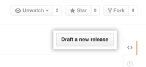
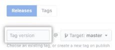
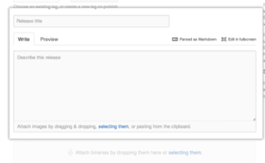

---
#
# Editable - Title and Description display on the page and in HTML meta tags
#
title: GitHub Releases
description: Releases allow users to download and deploy your project’s source code as a package with binary files and <b>release notes</b>.
#
# Don't edit items below - they control the page layout
#
return-top: yes
layout: page
page-type: subpage
page-description: yes

# same name for sidebar + pagination include
permalink: /guides/features/releases
#
---
The release notes describe any changes, improvements, and new features contained in the release.

Releases are dependent on git __[tags](https://git-scm.com/book/en/v2/Git-Basics-Tagging)__ . Tags are a way to label a specific point in the repository’s history _(e.g. v1.0.3, v2.4.2)_.

By tagging points in your project's history and creating releases from those tags, a user can determine which version of your project they want to to use and download it directly from your repository.

## Creating a Release

To create a release, you’ll need to have write access for the repository.

1. Navigate to the main page of the repository and click the __Releases__ link in the right-hand column.
1. If there are already releases, click __Draft a new release__. If this is the first release, click __Create a new release__.  
  
1. Type a version number for your release.  
  
1. Use the __Target__ drop-down menu to select the branch that contains the content you want to release.  
  
1. Type a title and description for your release.  
  
1. Optionally you can attach external files to your release. Attach files by dragging and dropping , selecting or pasting them into the __binaries__ box. These do not have to be binary files; any files needed for the release that are external to the repository are accepted.  
  
1. To notify users the release is not ready for production and may be unstable, select __This is a pre-release__.  
  
1. If you're ready to publicize your release, click __Publish release__. To work on the release later, click __Save draft__.  
  

## Learn More

For more information about creating and managing releases, please see [Releasing Projects on GitHub](https://docs.github.com/en/enterprise/2.18/user/github/administering-a-repository/releasing-projects-on-github).

---

[Return to Guides]({{ site.baseurl }}/guides)
